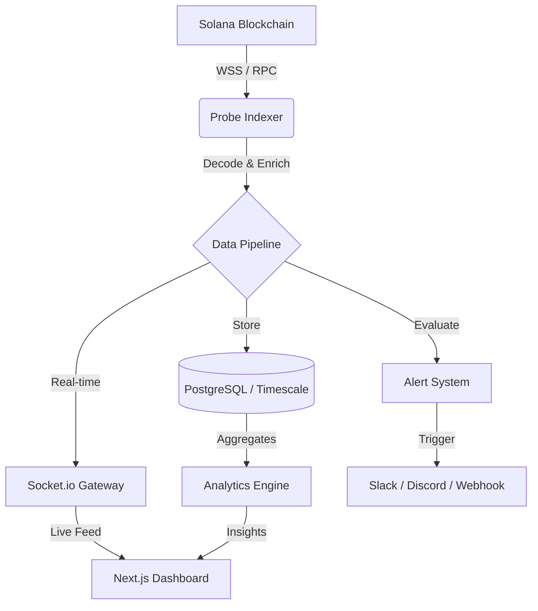

# 🛰️ Probe: Solana Program Observability Platform

<div align="center">


**The ultimate observability suite for Solana Developers. Monitor. Secure. Optimize. Scale.**

[](https://opensource.org/licenses/MIT)
[](https://nextjs.org/)
[](https://nestjs.com/)
[](https://solana.com/)
[](https://www.typescriptlang.org/)

[Website](https://probe.dev) • [Documentation](https://probe.dev/docs) • [Twitter](https://twitter.com/probe_dev) • [Discord](https://discord.gg/probe)

</div>

---

## ⚡ The Problem
Solana is fast, but development is opaque. Programs interact in complex "Cross-Program Invocation" (CPI) webs that are notoriously hard to debug. Hidden inefficiencies in compute units waste money, and malicious actors exploit signer bypasses in the blink of an eye.

## 🚀 The Solution: Probe
**Probe** is a full-stack observability platform that turns the "black box" of Solana programs into a transparent, actionable dashboard. It's not just a block explorer; it's a high-fidelity monitoring engine for the next generation of Solana applications.

---

## 🔥 Mindblowing Features

### 🕸️ Visual CPI Mapping
Don't just read logs—**see** the interactions. Probe generates real-time dependency graphs showing exactly how your program calls other protocols (Dexes, Oracles, Lending).
*   **Identify bottlenecks** in multi-step transactions.
*   **Trace errors** across program boundaries.

### 🛡️ Security Shield (Real-time Anomaly Detection)
Passive monitoring isn't enough. Probe uses AI-driven pattern recognition to detect:
*   **Signer Bypass Attempts**: Instant alerts when instructions lack proper authorization.
*   **Flash Loan Patterns**: Monitoring for sudden, massive liquidity movements.
*   **Reentrancy Risks**: Visualizing unexpected circular calls.

### 🐋 AI Wallet Intelligence
Know who is using your program. Our engine labels wallets based on behavior:
*   **Smart Money**: Wallets with high PnL on similar protocols.
*   **Bots/Arb**: High-frequency, low-latency automated traders.
*   **Whales**: Large position holders moving the needle.

### 📊 Real Economic Value (REV) Tracking
Go beyond simple "Volume". Probe filters out wash trading and bot noise to show you the **actual** economic activity driving your program's growth.

---

## 🏗️ The Tech Stack

| Layer | Technology |
| :--- | :--- |
| **Frontend** | Next.js 14 (App Router), TailwindCSS, Radix UI, Recharts |
| **Backend** | NestJS, Socket.io, BullMQ (Task Queue) |
| **Database** | PostgreSQL + TimescaleDB (Time-series), Redis (Caching) |
| **Blockchain** | @solana/web3.js, Anchor Framework |
| **Monitoring** | Prometheus, Grafana, Custom Rust Instrumentation |

---

## 🗺️ Architecture Overview



---

## 🛠️ Quick Start

### 1. Zero-Config Launch (Docker)
The fastest way to see the magic:
```bash
git clone https://github.com/your-org/probe.git
cd probe
docker-compose up -d
```
*Frontend: `http://localhost:3001` | Backend: `http://localhost:3000`*

### 2. Add Your Program
Once launched, simply enter your **Program ID**. Probe will:
1.  Fetch the **IDL** automatically from the chain.
2.  Start indexing transactions in real-time.
3.  Populate your dashboard with live metrics.

---

## 📦 Project Ecosystem

*   **`@probe/sdk`**: A lightweight TypeScript library to instrument your frontend or backend.
*   **`probe-cli`**: Manage your monitoring setup, export reports, and tail live logs from your terminal.
*   **`probe-instrumentation`**: A Rust crate for Anchor programs to emit custom, high-fidelity events directly to Probe.

---

## 📅 Roadmap: The Future of Observability

- [ ] **Phase 1**: ✅ Core Indexing, ✅ Real-time Dashboards, ✅ Basic Alerts.
- [ ] **Phase 2**: 🚧 Time-Travel Debugging (Replay transactions with local state overrides).
- [ ] **Phase 3**: 📅 Cross-Chain Observability (Track assets moving via IBC/Wormhole).
- [ ] **Phase 4**: 📅 Autonomous Response (Automated circuit breakers for detected exploits).

---

## 🤝 Contributing
Probe is built by the community, for the community. We're in early alpha and love PRs!
1. Check the [Issues](https://github.com/your-org/probe/issues).
2. Read the [Development Guide](./docs/09-DEVELOPMENT-GUIDE.md).
3. Join the [Discord](https://discord.gg/probe).

---

<div align="center">

**Built for the 1.1 million Solana developers who demand better tools.**

[Back to top](#-probe-solana-program-observability-platform)

</div>
